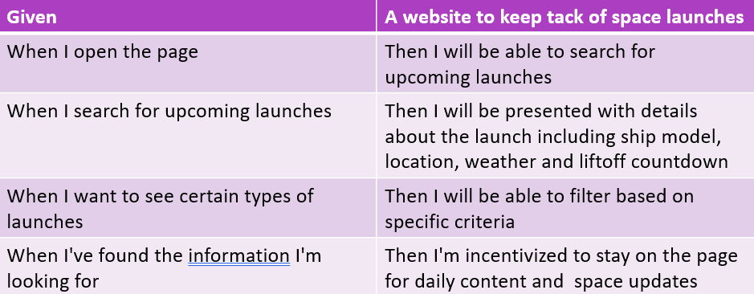
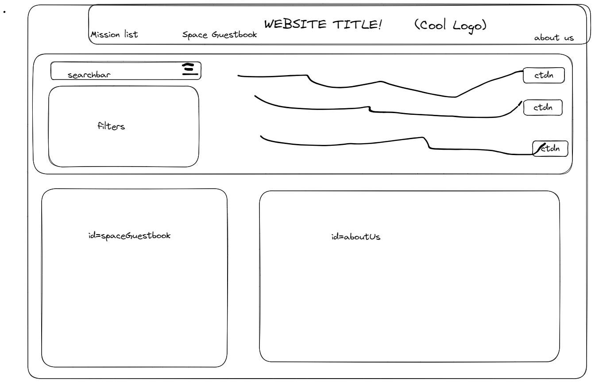
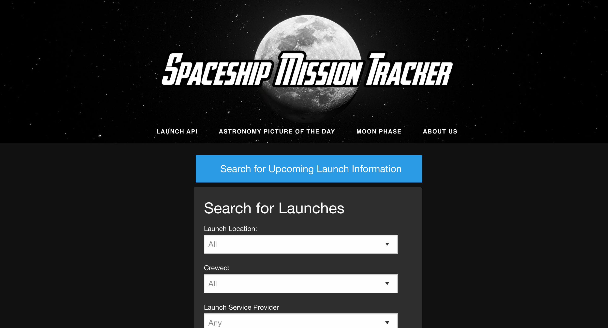
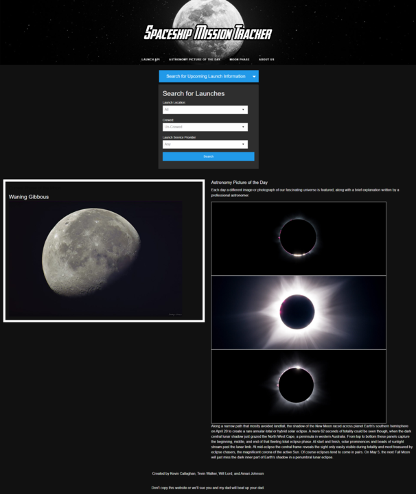
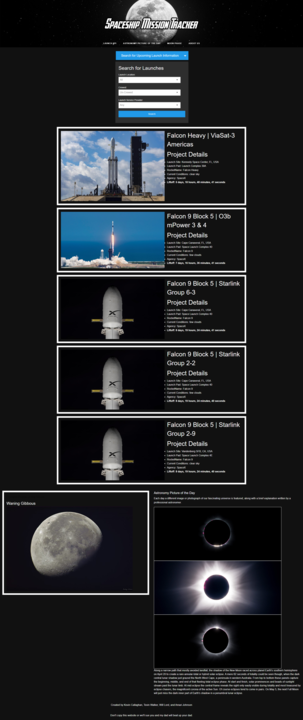

# Spaceship-Mission-Tracker

## Description

We were highly motivated to start this project because we wanted more knowledge about space with it being all on one webpage to make it easily accessible. This webpage helps users track up coming space launches, weather of that specific location, and daily tracking of moon phases and NASA's Astronomy Picture of the Day with an explanation included underneath the picture. We learned new thing about rockets and launches with a chance of learning or being presented with something we never seen or heard of with a new Astronomy picture daily aswell being able to track the moon phase daily.

## Acceptance-criteria

## Wire-Frame

This wire frame is a sketch of what we wanted our webpage to look like.

## Installation

There is no Installation required for this webpage.

## Usage

click the blue 'Search for Upcoming Launch Information' button the select if you by all and any or select to you preference.

## Credits

List of collaborators with links to our GitHub profiles.

Will Lord https://github.com/Masterchef842

Kevin Callaghan https://github.com/kevincallaghan 

Amari Johnson https://github.com/asjohnson8735

Tevin Walker https://github.com/teewalk32

    ~Tutorials followed for this project with included links to websites.~

How to use and write functions with NASA keys: https://www.youtube.com/watch?v=hk1ohonv4mk 

Article on favicon JavaScript: https://spemer.com/articles/set-favicon-with-javascript.html

API for NASA https://api.nasa.gov/

API for rockets https://ll.thespacedevs.com/2.2.0/launch/

API for moon phase https://rapidapi.com/sadasdasdlukedev/api/moon-phase

## License

MIT License 

## Webpage

Here's a pictures and link to the deployed webpage!

https://masterchef842.github.io/Spaceship-Mission-Tracker/
